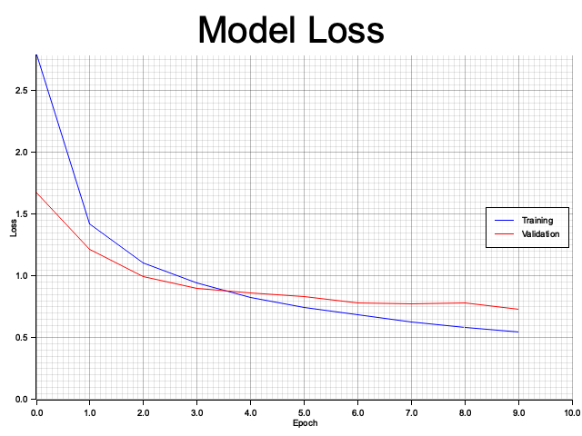
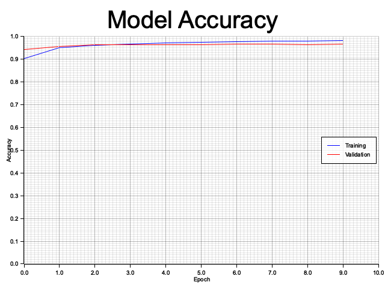

# Nabla ML

A user-friendly neural network library implemented in Rust, designed for simplicity and educational purposes. It draws inspiration from NumPy and TensorFlow, offering a robust multi-dimensional array implementation along with a wide range of mathematical and array manipulation functionalities. The library emphasizes ease of use, making it ideal for both beginners and experienced developers looking to explore machine learning concepts.

## Features

### Core Components

- **NDArray**: A versatile multi-dimensional array implementation supporting:
  - Fundamental operations (addition, subtraction, multiplication, division)
  - Broadcasting for operations like [N, M] + [1, M]
  - Shape manipulation (reshape, transpose)
  - Matrix operations (dot product)
  - Statistical functions (sum, mean)
  - Element-wise operations (exp, log, sqrt)
  - Padding functionality for batch processing

  Additionally...
    - **Array Creation**: Easily create 1D and 2D arrays from vectors and matrices.
    - **Random Arrays**: Generate arrays filled with random numbers, supporting both uniform and normal distributions.
    - **Arithmetic Operations**: Execute element-wise addition, subtraction, multiplication, and division.
    - **Mathematical Functions**: Apply a variety of functions including square root, exponential, sine, cosine, logarithm, hyperbolic tangent, ReLU, Leaky ReLU, and Sigmoid to arrays.
    - **Array Reshaping**: Modify the shape of arrays while preserving data integrity.
    - **File I/O**: Save and load arrays in a compressed format for efficient storage.
    - **Linear Regression**: Implement linear regression using gradient descent techniques.
    - **MNIST Dataset Handling**: Convert and load MNIST data seamlessly for machine learning tasks.

- **Neural Network Layers**:
  - Dense (Fully Connected) layers
  - Activation layers
  - Support for a variety of activation functions

### Activation Functions

- ReLU (Rectified Linear Unit)
- Leaky ReLU
- Sigmoid
- Softmax (for classification tasks)

### Optimizers

- Adam optimizer with customizable parameters:
  - Learning rate
  - Beta1 and Beta2 momentum parameters
  - Epsilon for numerical stability
  - Automatic handling of moment vector shapes

### Training Features

- Support for mini-batch training
- Automatic padding for batches
- Tracking of loss metrics
- Accuracy metrics for performance evaluation
- Broadcasting capabilities for efficient computations

## Example Usage

```rust
use nabla_ml::nab_model::NabModel;
use nabla_ml::nab_layers::NabLayer;

// Create model architecture
let input = NabModel::input(vec![784]);  // For MNIST: 28x28 = 784 input features
let dense1 = NabLayer::dense(784, 32, Some("relu"), Some("dense1"));
let x = input.apply(dense1);
let dense2 = NabLayer::dense(32, 32, Some("relu"), Some("dense2"));
let x = x.apply(dense2);
let output_layer = NabLayer::dense(32, 10, Some("softmax"), Some("output"));
let output = x.apply(output_layer);

// Create and compile model
let mut model = NabModel::new_functional(vec![input], vec![output]);
model.compile(
    "sgd",
    0.1,  // Adjusted learning rate
    "categorical_crossentropy",
    vec!["accuracy".to_string()]
);

// Train the model
let history = model.fit(
    &training_data, 
    &training_labels, 
    64,  // Batch size
    10,   // Number of epochs
    Some((&validation_data, &validation_labels)) // Optional validation data
);

model.summary();
```





### Usage

#### Array Creation

```rust
use nabla_ml::NDArray;

let arr = NDArray::from_vec(vec![1.0, 2.0, 3.0]);
let matrix = NDArray::from_matrix(vec![
    vec![1.0, 2.0, 3.0],
    vec![4.0, 5.0, 6.0],
]);
```

#### Random Arrays

```rust
use nabla_ml::NDArray;

let random_array = NDArray::randn(5);
let random_matrix = NDArray::randn_2d(3, 3);
let uniform_array = NDArray::rand_uniform(&[5]); // New function for uniform random arrays
```

#### Mathematical Functions

```rust
use nabla_ml::NDArray;

let arr = NDArray::from_vec(vec![0.0, 1.0, -1.0]);
let sqrt_arr = arr.sqrt();
let exp_arr = arr.exp();
let tanh_arr = arr.tanh();
let relu_arr = arr.relu();
let leaky_relu_arr = arr.leaky_relu(0.01);
let sigmoid_arr = arr.sigmoid();
let power_arr = arr.power(2.0); // New power function
```

#### Loss Functions

```rust
use nabla_ml::NabLoss;

let y_true = NDArray::from_vec(vec![1.0, 0.0, 1.0]);
let y_pred = NDArray::from_vec(vec![0.9, 0.2, 0.8]);
let mse = NabLoss::mean_squared_error(&y_true, &y_pred);
```

#### Optimizers

```rust
use nabla_ml::NablaOptimizer;

let mut weights = NDArray::from_vec(vec![1.0, 2.0, 3.0]);
let gradients = NDArray::from_vec(vec![0.1, 0.2, 0.3]);
let learning_rate = 0.1;

NablaOptimizer::sgd_update(&mut weights, &gradients, learning_rate);
```

#### Linear Regression

```rust
use nabla_ml::Nabla;

let X = NDArray::from_matrix(vec![
    vec![1.0, 2.0],
    vec![2.0, 3.0],
]);
let y = NDArray::from_vec(vec![1.0, 2.0]);
let (theta, history) = Nabla::linear_regression(&X, &y, 0.01, 1000);
```


### Relevant Code Snippets

Here are the relevant functions that were highlighted in the README:

#### NDArray Functions

```rust:src/nab_array.rs
impl NDArray {
    // Creates a 1D array of random numbers from a uniform distribution
    pub fn rand_uniform(shape: &[usize]) -> Self {
        let mut rng = rand::thread_rng();
        let data: Vec<f64> = (0..shape.iter().product()).map(|_| rng.gen_range(0.0..1.0)).collect();
        Self::new(data, shape.to_vec())
    }

    // Raises each element to the power of n
    pub fn power(&self, n: f64) -> Self {
        self.map(|x| x.powf(n))
    }
}
```

#### NabLoss Functions

```rust:src/nab_loss.rs
impl NabLoss {
    // Calculates the Mean Squared Error (MSE) between two arrays
    pub fn mean_squared_error(y_true: &NDArray, y_pred: &NDArray) -> f64 {
        let diff = y_true.subtract(y_pred);
        diff.multiply(&diff).mean()
    }

    // Calculates the Cross-Entropy Loss
    pub fn cross_entropy_loss(y_true: &NDArray, y_pred: &NDArray) -> f64 {
        let epsilon = 1e-8;
        let clipped_pred = y_pred.clip(epsilon, 1.0 - epsilon);
        -y_true.multiply(&clipped_pred.log()).sum() / y_true.shape()[0] as f64
    }
}
```

#### Nabla Optimizer Functions

```rust:src/nab_optimizers.rs
impl NablaOptimizer {
    // Performs Stochastic Gradient Descent (SGD) update
    pub fn sgd_update(weights: &mut NDArray, gradient: &NDArray, learning_rate: f64) {
        *weights = weights.subtract(&gradient.multiply_scalar(learning_rate));
    }
}
```

#### Nabla Linear Regression Function

```rust:src/nab_regression.rs
impl Nabla {
    // Performs linear regression using gradient descent
    pub fn linear_regression(X: &NDArray, y: &NDArray, alpha: f64, epochs: usize) -> (Vec<f64>, Vec<f64>) {
        let N = X.shape()[0];
        let mut theta = vec![0.0; X.shape()[1] + 1]; // +1 for the intercept
        let mut history = Vec::with_capacity(epochs);

        for _ in 0..epochs {
            // Predictions
            let y_pred: Vec<f64> = (0..N).map(|i| {
                theta[0] + X.data().iter().skip(i * X.shape()[1]).take(X.shape()[1]).zip(&theta[1..]).map(|(&x, &t)| x * t).sum::<f64>()
            }).collect();

            // Update theta based on gradients
            let gradients = linear_regression_gradients(X, y, &y_pred, N);
            for j in 0..theta.len() {
                theta[j] -= alpha * gradients[j];
            }

            // Store MSE for history
            let mse = NabLoss::mean_squared_error(y, &NDArray::from_vec(y_pred));
            history.push(mse);
        }
        (theta, history)
    }
}
```

#### File I/O with .nab Format
#### File I/O with .nab Format

```rust
use nabla_ml::{NDArray, save_nab, load_nab};

let array = NDArray::from_vec(vec![1.0, 2.0, 3.0, 4.0]);
save_nab("data.nab", &array).expect("Failed to save array");

let loaded_array = load_nab("data.nab").expect("Failed to load array");
assert_eq!(array.data(), loaded_array.data());
assert_eq!(array.shape(), loaded_array.shape());
```

#### Saving Multiple NDArrays

```rust
use nabla_ml::{NDArray, savez_nab};

let array1 = NDArray::from_vec(vec![1.0, 2.0, 3.0]);
let array2 = NDArray::from_vec(vec![4.0, 5.0, 6.0]);
let arrays = vec![("array1", &array1), ("array2", &array2)];
savez_nab("multiple_arrays.nab", arrays).expect("Failed to save multiple arrays");
```

#### Loading Multiple NDArrays

```rust
use nabla_ml::loadz_nab;

let loaded_arrays = loadz_nab("multiple_arrays.nab").expect("Failed to load multiple arrays");
assert_eq!(loaded_arrays["array1"].data(), array1.data());
assert_eq!(loaded_arrays["array2"].data(), array2.data());
```

#### MNIST Dataset Handling

```rust
use nabla_ml::NabMnist;
use nabla_ml::nab_utils::NabUtils;

NabMnist::mnist_csv_to_nab(
    "csv/mnist_test.csv",
    "datasets/mnist_test_images.nab",
    "datasets/mnist_test_labels.nab",
    vec![28, 28]
).expect("Failed to convert MNIST CSV to NAB format");

let ((train_images, train_labels), (test_images, test_labels)) = 
    NabUtils::load_and_split_dataset("datasets/mnist_test", 80.0).expect("Failed to load and split dataset");
```

### Relevant Code Snippets

Here are the relevant functions that were highlighted in the README:

#### File I/O Functions

```rust:src/nab_io.rs
use std::fs::File;
use std::io::{self, Write, Read};
use flate2::{write::GzEncoder, read::GzDecoder};
use serde::{Serialize, Deserialize};
use crate::nab_array::NDArray;

#[derive(Serialize, Deserialize)]
struct SerializableNDArray {
    data: Vec<f64>,
    shape: Vec<usize>,
}

/// Saves an NDArray to a .nab file with compression
pub fn save_nab(filename: &str, array: &NDArray) -> io::Result<()> {
    let file = File::create(filename)?;
    let mut encoder = GzEncoder::new(file, flate2::Compression::default());
    let serializable_array = SerializableNDArray {
        data: array.data().to_vec(),
        shape: array.shape().to_vec(),
    };
    let serialized_data = bincode::serialize(&serializable_array).unwrap();
    encoder.write_all(&serialized_data)?;
    encoder.finish()?;
    Ok(())
}

/// Loads an NDArray from a compressed .nab file
pub fn load_nab(filename: &str) -> io::Result<NDArray> {
    let file = File::open(filename)?;
    let mut decoder = GzDecoder::new(file);
    let mut serialized_data = Vec::new();
    decoder.read_to_end(&mut serialized_data)?;
    let serializable_array: SerializableNDArray = bincode::deserialize(&serialized_data).unwrap();
    Ok(NDArray::new(serializable_array.data, serializable_array.shape))
}
```

#### MNIST Handling Functions

```rust:src/nab_mnist.rs
use crate::nab_array::NDArray;
use crate::nab_io::save_nab;

pub struct NabMnist;

impl NabMnist {
    /// Converts MNIST CSV data to image and label .nab files
    pub fn mnist_csv_to_nab(
        csv_path: &str,
        images_path: &str,
        labels_path: &str,
        image_shape: Vec<usize>
    ) -> std::io::Result<()> {
        let mut rdr = csv::Reader::from_path(csv_path)?;
        let mut images = Vec::new();
        let mut labels = Vec::new();
        let mut sample_count = 0;

        for result in rdr.records() {
            let record = result?;
            sample_count += 1;

            if let Some(label) = record.get(0) {
                labels.push(label.parse::<f64>()?);
            }

            for value in record.iter().skip(1) {
                let pixel: f64 = value.parse()?;
                images.push(pixel);
            }
        }

        let mut full_image_shape = vec![sample_count];
        full_image_shape.extend(image_shape);
        let images_array = NDArray::new(images, full_image_shape);
        save_nab(images_path, &images_array)?;

        let labels_array = NDArray::new(labels, vec![sample_count]);
        save_nab(labels_path, &labels_array)?;

        Ok(())
    }
}
```

Mnist dataset in .nab format can be found [here](https://github.com/enricozanardo/nabla_datasets/tree/main/mnist)


## License

This project is licensed under the AGPL-3.0 License - see the [LICENSE](LICENSE) file for details.


