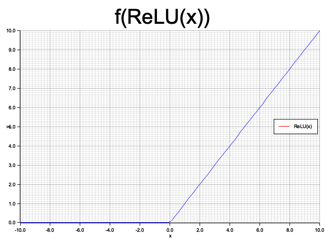
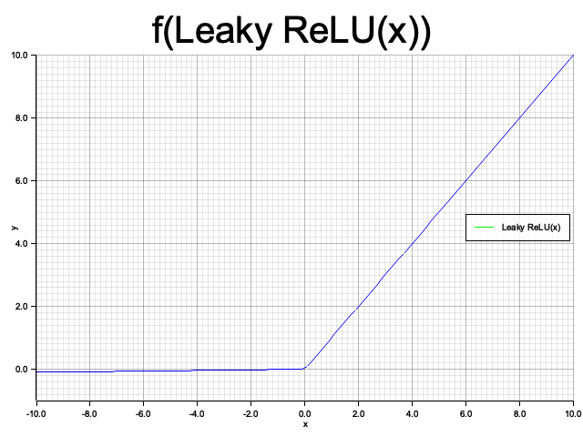
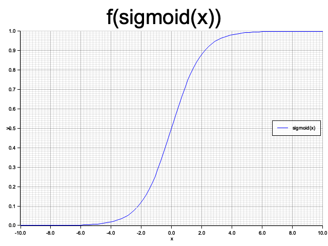

# Nabla-ML

Nabla-ML is a Rust library inspired by NumPy, providing a multi-dimensional array implementation with various mathematical and array manipulation functionalities.

## Features

- **Array Creation**: Create 1D and 2D arrays using vectors and matrices.
- **Random Arrays**: Generate arrays with random numbers, including uniform and normal distributions.
- **Arithmetic Operations**: Perform element-wise addition, subtraction, multiplication, and division.
- **Mathematical Functions**: Apply functions like square root, exponential, sine, cosine, logarithm, hyperbolic tangent, ReLU, Leaky ReLU, and Sigmoid to arrays.
- **Array Reshaping**: Change the shape of arrays while maintaining data integrity.
- **Indexing and Slicing**: Access and modify elements using indices and slices.
- **Conditional Selection**: Filter arrays based on conditions.
- **Array Attributes**: Retrieve attributes like number of dimensions, shape, size, and data type.
- **Axis Manipulation**: Add new axes to arrays to increase dimensionality.
- **File I/O**: Save and load arrays using a custom `.nab` file format with compression.

## Usage

### Creating Arrays

```rust
use nabla_ml::NDArray;
// Create a 1D array
let arr = NDArray::from_vec(vec![1.0, 2.0, 3.0]);
// Create a 2D array
let mat = NDArray::from_matrix(vec![
vec![1.0, 2.0, 3.0],
vec![4.0, 5.0, 6.0],
]);
```


### Random Arrays

```rust
// Create a 1D array of random numbers between 0 and 1
let rand_arr = NDArray::rand(5);
// Create a 2D array of random integers between 1 and 10
let rand_int_mat = NDArray::randint_2d(1, 10, 3, 3);
```

### Arithmetic Operations

```rust
let arr1 = NDArray::from_vec(vec![1.0, 2.0, 3.0]);
let arr2 = NDArray::from_vec(vec![4.0, 5.0, 6.0]);
// Element-wise addition
let sum = arr1.clone() + arr2;
// Scalar multiplication
let scaled = arr1.clone() *  2.0;
```

### Mathematical Functions

```rust
let arr = NDArray::from_vec(vec![1.0, 4.0, 9.0]);
// Calculate square roots
let sqrt_arr = arr.sqrt();
// Calculate exponentials
let exp_arr = arr.exp();

// Calculate hyperbolic tangent
let tanh_arr = arr.tanh();
```

```rust
// Apply ReLU
let relu_arr = arr.relu();
```     



```rust
// Apply Leaky ReLU with alpha = 0.01
let leaky_relu_arr = arr.leaky_relu(0.01);
```



```rust
// Apply Sigmoid
let sigmoid_arr = arr.sigmoid();
```




### Reshaping Arrays

```rust
let arr = NDArray::from_vec(vec![1.0, 2.0, 3.0, 4.0, 5.0, 6.0]);
let reshaped = arr.reshape(vec![2, 3]);
```

### Indexing and Slicing

```rust
let arr = NDArray::from_vec(vec![0.69, 0.94, 0.66, 0.73, 0.83]);
// Access an element
let first = arr.get(0);
// Slice the array
let slice = arr.slice(1, 4);
```

### Conditional Selection

```rust
let arr = NDArray::from_vec(vec![0.69, 0.94, 0.66, 0.73, 0.83]);
// Filter elements greater than 0.7
let filtered = arr.filter(|&x| x > 0.7);
```

### Array Attributes

```rust
let arr = NDArray::from_matrix(vec![
vec![1.0, 2.0, 3.0],
vec![4.0, 5.0, 6.0],
]);
// Get number of dimensions
let ndim = arr.ndim();
// Get shape
let shape = arr.shape();
// Get size
let size = arr.size();
// Get data type
let dtype = arr.dtype();
```

### Axis Manipulation

```rust
let arr = NDArray::from_vec(vec![1.0, 2.0, 3.0, 4.0, 5.0, 6.0]);
// Add a new axis
let row_vector = arr.new_axis(0);
let col_vector = arr.new_axis(1);
```

### File I/O with .nab Format

#### Save and Load a Single Array

```rust
use nabla_ml::{NDArray, save_nab, load_nab};

// Create an NDArray
let array = NDArray::from_vec(vec![1.0, 2.0, 3.0, 4.0]);

// Save the array to a .nab file
save_nab("data.nab", &array).expect("Failed to save array");

// Load the array from the .nab file
let loaded_array = load_nab("data.nab").expect("Failed to load array");

// Verify the loaded data
assert_eq!(array.data(), loaded_array.data());
assert_eq!(array.shape(), loaded_array.shape());
```

#### Save Multiple Arrays

```rust
use nabla_ml::{NDArray, savez_nab};

fn main() -> std::io::Result<()> {
    let array1 = NDArray::from_vec(vec![1.0, 2.0, 3.0]);
    let array2 = NDArray::from_vec(vec![4.0, 5.0, 6.0]);

    // Save arrays with specified names
    savez_nab("data.nab", vec![("x", &array1), ("y", &array2)])?;

    Ok(())
}
```

## License

This project is licensed under the AGPL-3.0 License - see the [LICENSE](LICENSE) file for details.