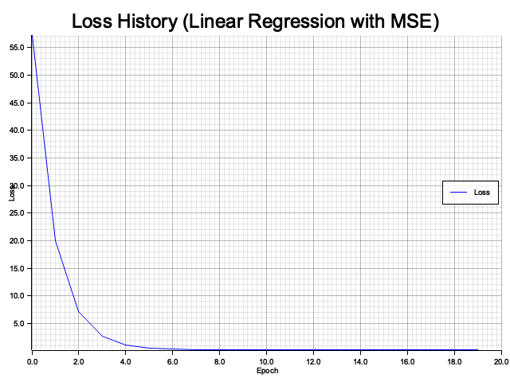
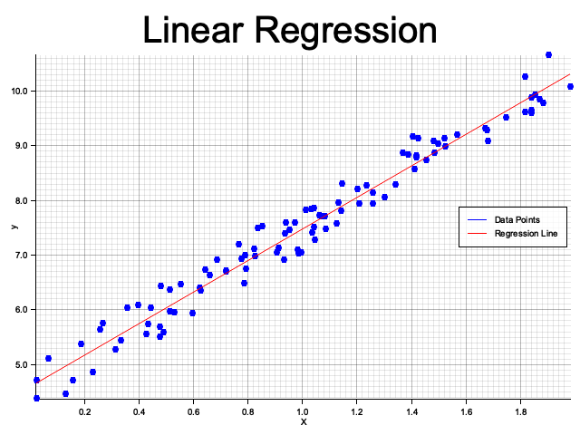
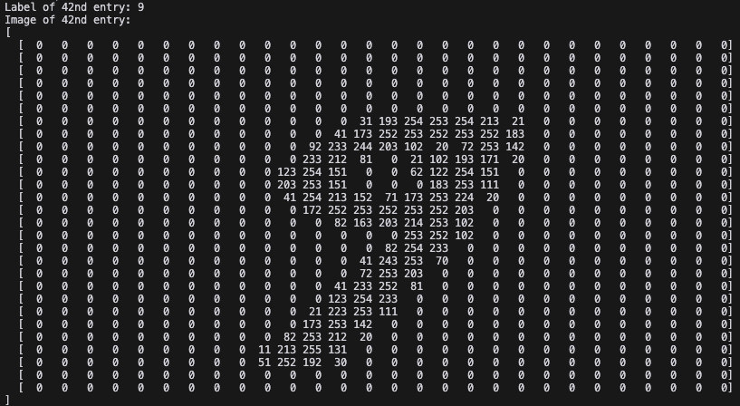

# Nabla-ML

Nabla-ML is a Rust library inspired by NumPy, providing a multi-dimensional array implementation with various mathematical and array manipulation functionalities.

## Features

- **Array Creation**: Create 1D and 2D arrays using vectors and matrices.
- **Random Arrays**: Generate arrays with random numbers, including uniform and normal distributions.
- **Arithmetic Operations**: Perform element-wise addition, subtraction, multiplication, and division.
- **Mathematical Functions**: Apply functions like square root, exponential, sine, cosine, logarithm, hyperbolic tangent, ReLU, Leaky ReLU, and Sigmoid to arrays.
- **Array Reshaping**: Change the shape of arrays while maintaining data integrity.
- **File I/O**: Save and load arrays in a compressed format.
- **Linear Regression**: Perform linear regression using gradient descent.
- **MNIST Dataset Handling**: Convert and load MNIST data for machine learning tasks.


### Usage

#### Array Creation

```rust
use nabla_ml::NDArray;

let arr = NDArray::from_vec(vec![1.0, 2.0, 3.0]);
let matrix = NDArray::from_matrix(vec![
    vec![1.0, 2.0, 3.0],
    vec![4.0, 5.0, 6.0],
]);
```

#### Random Arrays

```rust
use nabla_ml::NDArray;

let random_array = NDArray::randn(5);
let random_matrix = NDArray::randn_2d(3, 3);
```

#### Mathematical Functions

```rust
use nabla_ml::NDArray;

let arr = NDArray::from_vec(vec![0.0, 1.0, -1.0]);
let sqrt_arr = arr.sqrt();
let exp_arr = arr.exp();
let tanh_arr = arr.tanh();
let relu_arr = arr.relu();
let leaky_relu_arr = arr.leaky_relu(0.01);
let sigmoid_arr = arr.sigmoid();
```

#### File I/O with .nab Format

```rust
use nabla_ml::{NDArray, save_nab, load_nab};

let array = NDArray::from_vec(vec![1.0, 2.0, 3.0, 4.0]);
save_nab("data.nab", &array).expect("Failed to save array");

let loaded_array = load_nab("data.nab").expect("Failed to load array");
assert_eq!(array.data(), loaded_array.data());
assert_eq!(array.shape(), loaded_array.shape());
```

#### Linear Regression

```rust
use nabla_ml::NDArray;

let X = NDArray::from_matrix(vec![
    vec![0.0, 0.0],
    vec![1.0, 0.0],
    vec![0.0, 1.0],
    vec![1.0, 1.0],
]);
let y = NDArray::from_vec(vec![1.0, 2.0, 3.0, 4.0]);

let (theta, history) = NDArray::linear_regression(&X, &y, 0.01, 1000);
println!("Parameters: {:?}", theta);
```

#### MNIST Dataset Handling

```rust
use nabla_ml::NDArray;

NDArray::mnist_csv_to_nab(
    "csv/mnist_test.csv",
    "datasets/mnist_test_images.nab",
    "datasets/mnist_test_labels.nab",
    vec![28, 28]
).expect("Failed to convert MNIST CSV to NAB format");

let ((train_images, train_labels), (test_images, test_labels)) = 
    NDArray::load_and_split_dataset("datasets/mnist_test", 80.0).expect("Failed to load and split dataset");
```

Mnist dataset in .nab format can be found [here](https://github.com/enricozanardo/nabla_datasets/tree/main/mnist)

#### One-Hot Encoding

```rust
use nabla_ml::NDArray;

// Convert labels to one-hot encoded format
let labels = vec![0, 1, 2, 1, 0];
let one_hot = NDArray::one_hot_encode(&labels);

// Result will be a 2D NDArray:
// [1, 0, 0]  # Class 0
// [0, 1, 0]  # Class 1
// [0, 0, 1]  # Class 2
// [0, 1, 0]  # Class 1
// [1, 0, 0]  # Class 0
```






## License

This project is licensed under the AGPL-3.0 License - see the [LICENSE](LICENSE) file for details.


